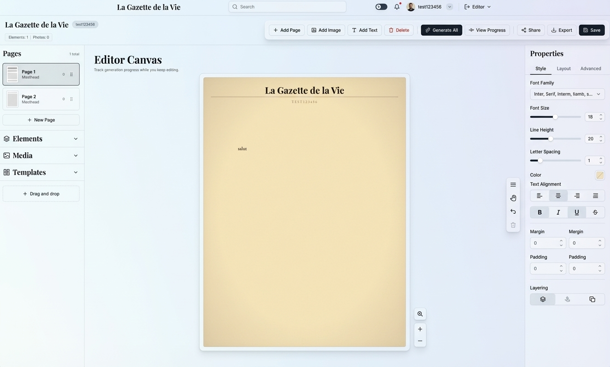

# La Gazette de la Vie - UI Mockups

> User interface designs and wireframes

---

## Current Design Reference

The complete UI design for La Gazette de la Vie is shown in the reference image:



---

## 1. Overview

The application follows a **three-panel editor layout** optimized for newspaper/gazette creation:

1. **Left Sidebar**: Navigation and content library (Pages, Elements, Media, Templates)
2. **Center Canvas**: Main editing area with gazette page preview
3. **Right Sidebar**: Properties panel for selected element styling

---

## 2. Application Structure

### 2.1 Top Navigation Bar

The top navbar contains:

- **Logo/Brand**: "La Gazette de la Vie" (clickable, returns to home/project list)
- **Search Bar**: Global search across projects and content
- **Dark Mode Toggle**: Theme switcher
- **Notifications**: Bell icon with notification badge
- **User Profile**: Avatar with username dropdown
- **Editor Dropdown**: Context selector (switches between Editor/Viewer modes)

**Technology**: shadcn/ui components

- `Input` with search icon for search bar
- `Button` with `variant="ghost"` for icon buttons
- `DropdownMenu` for user menu and editor selector
- `Badge` for notification count

---

### 2.2 Editor Toolbar

Horizontal action bar below navbar with primary editing actions:

| Button        | Icon          | Variant        | Action                          |
| ------------- | ------------- | -------------- | ------------------------------- |
| Add Page      | + icon        | Outline        | Opens page template selector    |
| Add Image     | Image icon    | Outline        | Opens image upload dialog       |
| Add Text      | T icon        | Outline        | Adds text element to canvas     |
| Delete        | Trash icon    | Destructive    | Deletes selected element        |
| Generate All  | Sparkles      | Primary (Gold) | Starts animation generation     |
| View Progress | Progress icon | Outline        | Opens generation progress panel |
| Share         | Share icon    | Outline        | Opens share dialog              |
| Export        | Download icon | Outline        | Export dropdown menu            |
| Save          | Save icon     | Primary (Gold) | Saves current state             |

**Component Pattern**: Button groups with vertical separators

```tsx
<div className="flex items-center gap-2">
  <Button variant="outline">
    <Plus /> Add Page
  </Button>
  <Button variant="outline">
    <Image /> Add Image
  </Button>
  <Button variant="outline">
    <Type /> Add Text
  </Button>
  <Separator orientation="vertical" className="h-6" />
  <Button variant="destructive">
    <Trash2 /> Delete
  </Button>
  <Separator orientation="vertical" className="h-6" />
  <Button>
    <Sparkles /> Generate All
  </Button>
  <Button variant="outline">View Progress</Button>
  <Separator orientation="vertical" className="h-6" />
  <Button variant="outline">
    <Share2 /> Share
  </Button>
  <Button variant="outline">
    <Download /> Export
  </Button>
  <Button>
    <Save /> Save
  </Button>
</div>
```

---

### 2.3 Left Sidebar - Navigation Panel

Width: ~200px on desktop, collapsible on tablet/mobile

#### 2.3.1 Project Info Header

```
La Gazette de la Vie        [Badge: test123456]
Elements: 1 | Photos: 0
```

Shows current project name and content statistics.

#### 2.3.2 Pages Section

- **Header**: "Pages" with total count badge (e.g., "1 total")
- **Page List**: Vertical list of page cards
  - Each card shows: thumbnail preview, page number, page name
  - Dropdown menu (⋮) for page actions: Duplicate, Delete, Rename
  - Selected page has highlighted border
- **New Page Button**: `+ New Page` at bottom

**Component**: Custom `PageCard` using shadcn `Card` + `DropdownMenu`

#### 2.3.3 Collapsible Sections

Uses `Accordion` component:

- **Elements**: Draggable UI elements (text boxes, shapes, dividers)
- **Media**: Image library from uploads
- **Templates**: Pre-designed page layouts

Each section expands/collapses independently.

At the bottom: "Drag and drop" helper text with icon.

---

### 2.4 Center Canvas - Editor Area

The main editing surface with gazette page preview.

**Features**:

- Paper texture background (parchment color #F4E4BC)
- Vignette effect on edges
- Drop shadow for depth
- Zoom controls (floating bottom-right):
  - Zoom in button (magnifying glass with +)
  - Zoom percentage
  - Zoom out button (-)

**Canvas Header**:

```
Editor Canvas
Track generation progress while you keep editing.
```

**Element Selection**:

- Selected elements show blue outline with resize handles
- Hover shows subtle highlight
- Click to select, double-click to edit text

---

### 2.5 Right Sidebar - Properties Panel

Width: ~280px on desktop, collapsible on tablet

**Header**: "Properties"

**Tabs**:

- Style (active by default)
- Layout
- Advanced

#### 2.5.1 Style Tab

**Typography Section**:

- **Font Family**: Dropdown selector (shows: "Inter, Serif, Interm, Iamb, s...")
- **Font Size**: Slider with numeric input (range: 8-72, value: 18)
- **Line Height**: Slider with numeric input (range: 1.0-3.0, value: 20)
- **Letter Spacing**: Slider with numeric input (range: -2 to 10, value: 1)

**Color & Alignment**:

- **Color Picker**: Button showing current color with color swatch
- **Text Alignment**: 4 icon buttons (left, center, right, justify)

**Text Styling**:

- Bold, Italic, Underline, Strikethrough toggle buttons

**Spacing Section**:

- **Margin**: Dual numeric inputs (horizontal/vertical)
- **Padding**: Dual numeric inputs (horizontal/vertical)

**Layering Section**:

- Send to back, Send backward, Bring forward, Bring to front buttons

**Floating Toolbar** (left of properties panel):

- Text alignment (top)
- Cursor/select tool
- Undo
- Delete element

---

## 3. Modals & Dialogs

### 3.1 Image Upload Modal

Triggered by "Add Image" button.

**Components**:

- `Dialog` wrapper
- Drag-and-drop zone with dashed border
- File input (hidden, triggered by click)
- Upload progress bar (`Progress` component)
- Supported formats notice
- Paste from clipboard support

### 3.2 Animation Suggestion Modal

Appears after image upload (for generation flow).

**Layout**:

- Image preview (left side)
- AI analysis description
- Radio group with 3 suggested animations (`RadioGroup` component)
- Custom prompt textarea (character limit: 200)
- Cancel + "Save & Continue" buttons

### 3.3 Generation Progress Panel

Shows during video generation process.

**Components**:

- Overall progress bar
- List of individual video generation tasks
- Status icons: ✓ Complete, ⟳ Processing, ◷ Queued, ✗ Failed
- Individual progress bars for active tasks
- Time remaining estimate
- "Minimize to Background" button

### 3.4 Share Dialog

**Components**:

- Share link input with copy button
- Password display
- Social share buttons (Email, WhatsApp, Message, Gmail)
- QR code option (expandable)

### 3.5 Export Menu

Dropdown menu triggered by Export button:

- Download as HTML (with description)
- Download Videos (ZIP)
- Print / Save PDF

**Component**: `DropdownMenu` with icons

---

## 4. Page Templates

Four pre-designed templates available when adding a new page:

1. **Classic Front Page**: 1 hero image (16:9) + 2 secondary (1:1)
2. **Two Column Feature**: 2 equal images (4:3) + 1 wide (21:9)
3. **Grid Gallery**: 3 grid images (1:1) + 1 featured (16:9)
4. **Magazine Spread**: 4 varied size images with text flow

---

## 5. Viewer Mode (Read-Only)

Simplified interface for viewing published gazettes:

- No editing toolbar
- No sidebars
- Full-width canvas
- Page navigation at bottom: `◄  Page 1 of 3  ►`
- Videos auto-play on loop
- Lock icon indicates read-only mode

---

## 6. Responsive Breakpoints

### Desktop (1024px+)

- Full three-panel layout
- All features visible

### Tablet (768px - 1023px)

- Left sidebar collapsible (Sheet drawer)
- Right properties panel collapsible
- Toolbar remains visible

### Mobile (< 768px)

- **Viewer only** (editing not supported)
- Single column layout
- Touch-friendly navigation
- Videos play on tap

---

## 7. Component Summary

### shadcn/ui Components Used

| Component    | Usage Count | Primary Use                          |
| ------------ | ----------- | ------------------------------------ |
| Button       | 20+         | Actions, toolbar, dialogs            |
| Input        | 10+         | Search, forms, numeric inputs        |
| Card         | 8+          | Page cards, panels                   |
| Dialog       | 5           | Modals for upload, animation, share  |
| DropdownMenu | 6           | Page actions, export menu, user menu |
| Separator    | 10+         | Toolbar grouping                     |
| Progress     | 5+          | Upload, generation status            |
| Accordion    | 3           | Left sidebar sections                |
| Tabs         | 3           | Properties panel navigation          |
| RadioGroup   | 1           | Animation selection                  |
| Sheet        | 2           | Mobile navigation                    |
| Tooltip      | 15+         | Icon button hints                    |
| Badge        | 4+          | Counts, status indicators            |
| Slider       | 6+          | Font size, spacing controls          |

---

## 8. Design Tokens

### Colors

| Token      | Hex     | Usage                       |
| ---------- | ------- | --------------------------- |
| Ink (Text) | #2C2416 | Primary text                |
| Sepia      | #5C4033 | Headlines, borders          |
| Muted      | #8B7355 | Secondary text              |
| Gold       | #C9A227 | Primary actions, highlights |
| Parchment  | #F4E4BC | Gazette background          |
| Cream      | #FDF8E8 | App background              |
| Aged Red   | #8B2E2E | Destructive actions         |

### Typography

| Element    | Font              | Weight     | Size    |
| ---------- | ----------------- | ---------- | ------- |
| Masthead   | Playfair Display  | 700        | 36-48px |
| Headline   | Old Standard TT   | 700        | 24-32px |
| Subheading | Libre Baskerville | 400 Italic | 16-20px |
| Body       | EB Garamond       | 400        | 14-16px |
| UI Labels  | Inter             | 400-600    | 12-14px |

---

_UI Mockups v2.0_
_Last Updated: December 19, 2024_
_Reference Image: UI_MOCKUP.jpeg_
